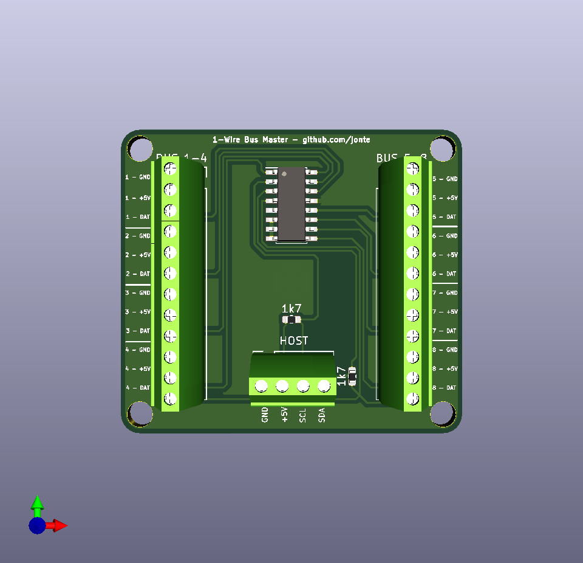

1-Wire Bus Master
=================

These are KiCad schematics and project files for a 1-Wire Bus Master module,
capable of mastering 8 1-Wire busses.

This module is meant to be connected to, and driven by, a host uC, such as a Raspberry Pi or an Arduino. The host uC must be capable of I2C communication.

The module is powered by the Maxim DS2482 1-Wire bus master chip.

Features
--------

- Break-out of 8 1-Wire busses from the DS2482
- Screw terminal connectors for host and all 8 busses
- 4.5cm x 4cm footprint
- 4 x 3.4mm mounting holes (M3 clearance hole size)

3D Rendering
------------

License
-------

This project is licensed under the CERN Open Hardware Licence v1.2.

See LICENSE.txt
