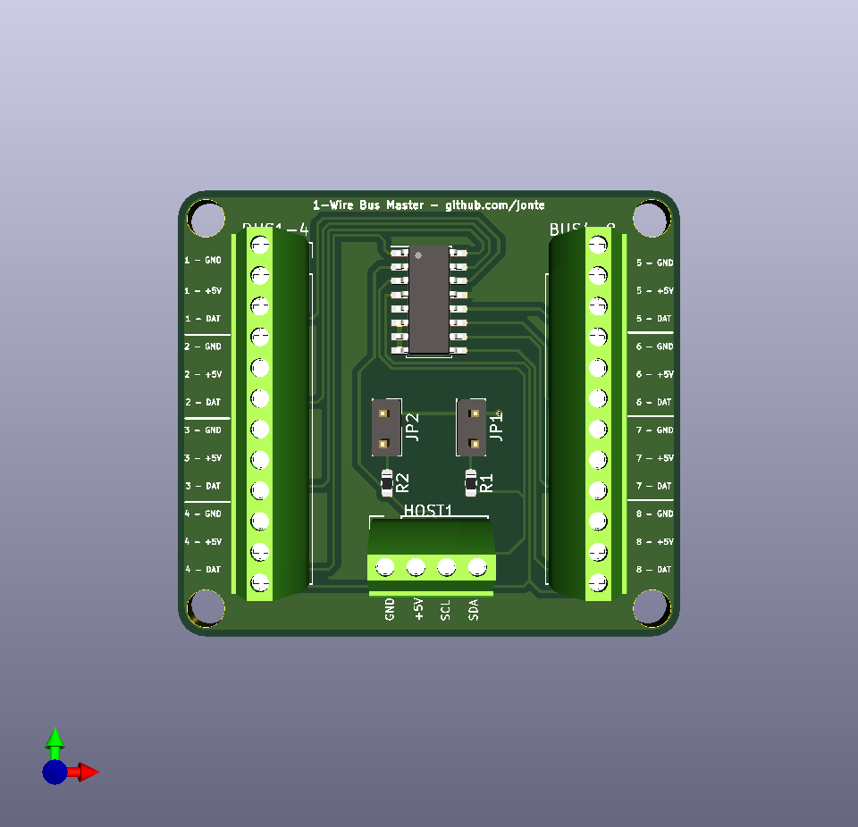

1-Wire Bus Master
=================

These are KiCad schematics and project files for a 1-Wire Bus Master module,
capable of mastering 8 1-Wire busses.

This module is meant to be connected to, and driven by, a host uC, such as a Raspberry Pi or an Arduino. The host uC must be capable of I2C communication.

The module is powered by the Maxim DS2482 1-Wire bus master chip.

Features
--------

- Break-out of 8 1-Wire busses from the DS2482
- Screw terminal connectors for host and all 8 busses
- 4.5cm x 4cm footprint
- 4 x 3.4mm mounting holes (M3 clearance hole size)
- Optional pull-up resistors for SDA and SCL (toggled via jumpers)

Notes for Raspberry Pi
----------------------

The Raspberry Pi has internal pull-ups for I2C, so the J1 and J2 jumpers should not be populated when using a Raspberry Pi.

The I2C bus must be enabled to communicate with the board, this can be done using `raspi-config`, in the `Interfacing Options -> I2C` menu.

The ds2482 kernel module, included in the mainline kernels, is compatible with this board and can be used as follows:

    modprobe ds2482
    echo ds2482 0x18 > /sys/bus/i2c/devices/i2c-1/new_device

In the above example, `0x18` is the board's I2C address. This will remain valid as long as the `AD0-2` pins are connected to ground. If you change this, you will also have to change the board I2C address.

The bus master devices, and any connected 1-Wire devices will appear under `/sys/bus/w1/devices/`.

3D Rendering
------------

License
-------

This project is licensed under the CERN Open Hardware Licence v1.2.

See LICENSE.txt
